# Custom Basic Auth 

## Securing WeatherForecast Controller
Here we secured the default Web API controller class `WeatherForecast` with a custom Basic Authentication attribute called `[BasicAuth]`.

## Results
1. **Default Screen**
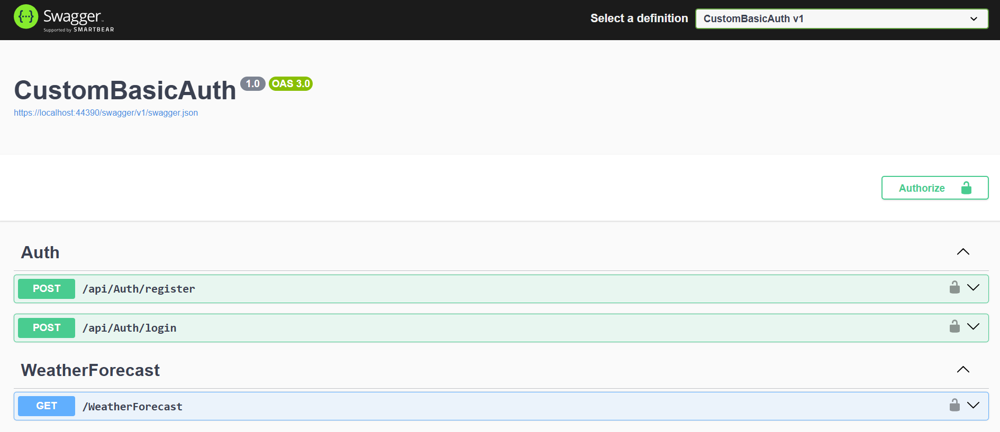

2. **Register endpoint**
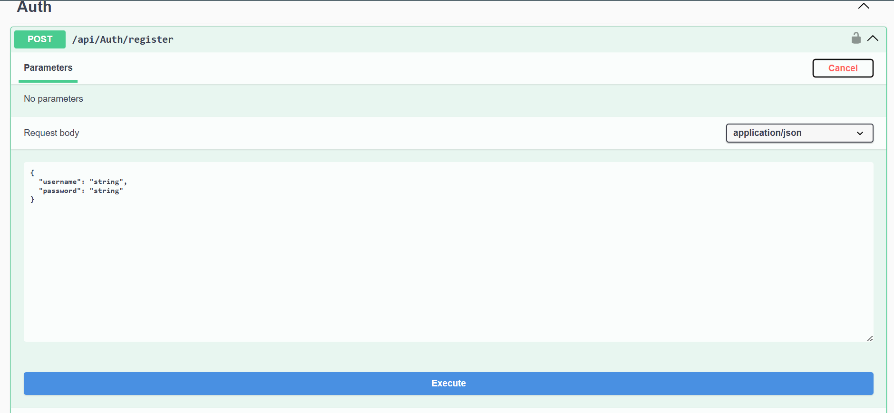

3. **Register endpoint successful response**
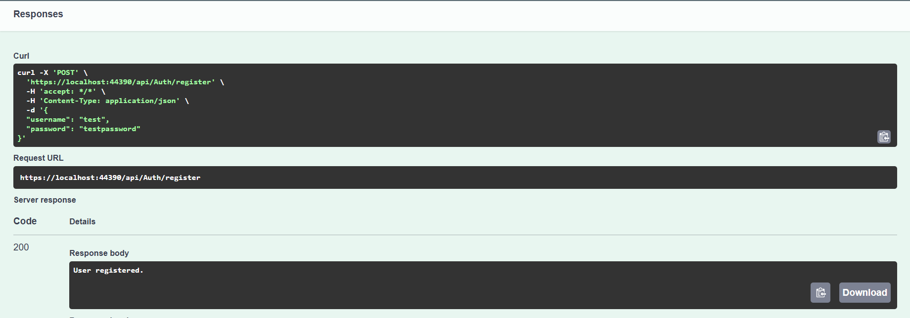

4. **Register endpoint with errors**
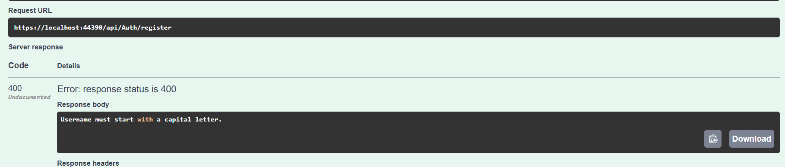
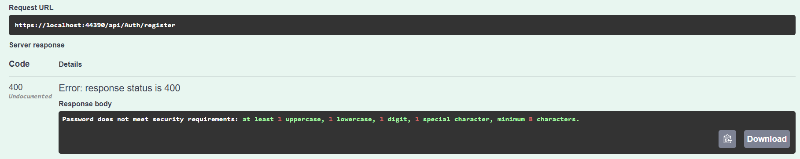

4. **Login endpoint**
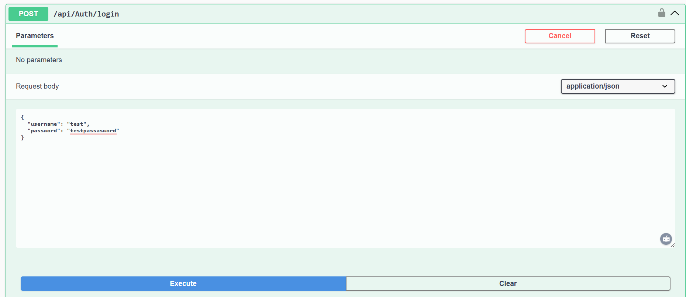

5. **Login endpoint successful response**
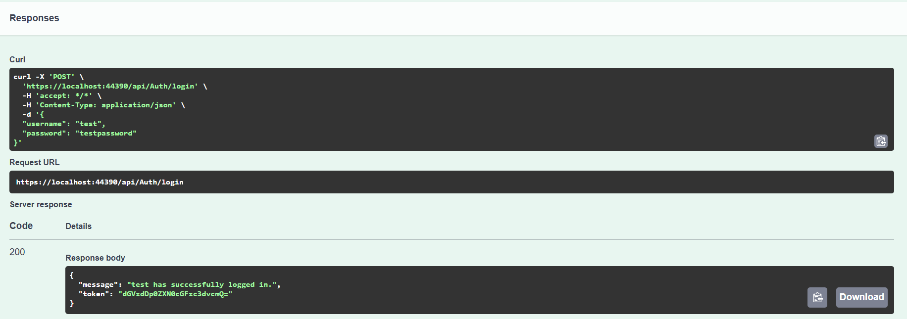

6. **Login endpoint failed response**
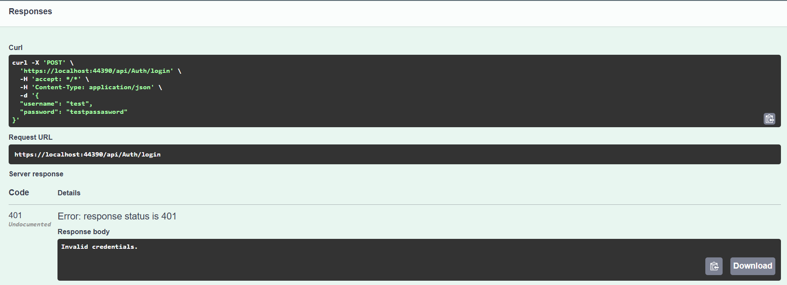

7. **Swagger Authorization**
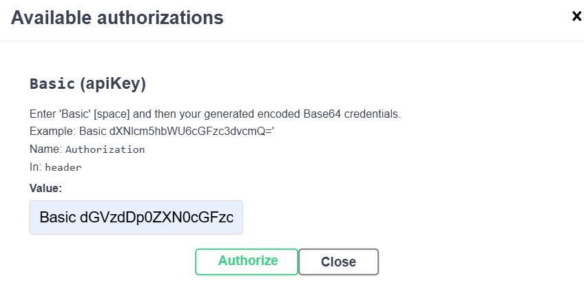

8. **Protected endpoint's successful response**
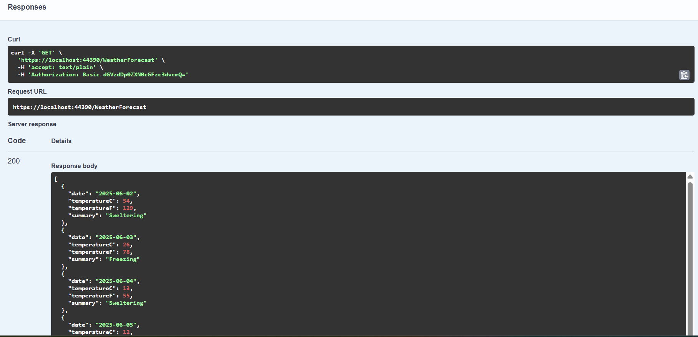

9. **Protected endpoint's failed response**
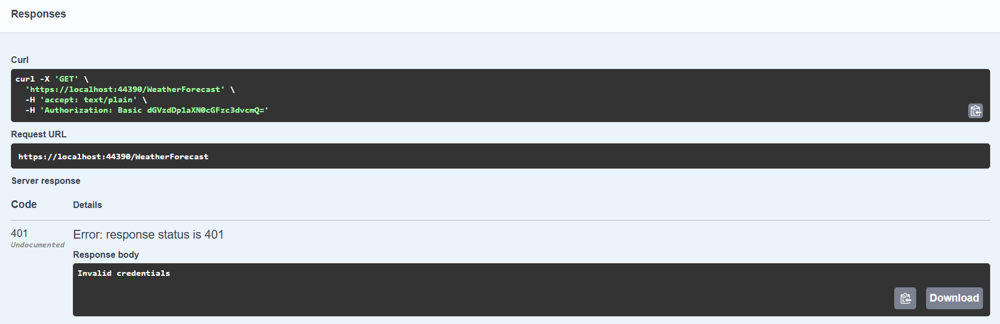